# Aegis AI Backend - Architecture Diagrams

---

## 1. High-Level System Architecture

```mermaid
graph TB
    User["👤 User (Browser)"]

    subgraph Frontend["Frontend (Next.js)"]
        UI["React UI"]
        Models["models.ts - Model Selection"]
    end

    subgraph Backend["Aegis AI Backend (FastAPI - Port 8000)"]
        subgraph Routers["API Routers"]
            AuthR["/auth"]
            ChatR["/api/chat"]
            DocsR["/api/documents"]
            VoteR["/api/vote"]
            FilesR["/api/files"]
        end

        subgraph AILayer["AI Layer"]
            Gateway["GatewayClient\n(gateway_client.py)"]
            Claude["ClaudeClient\n(claude_client.py)"]
            Gemini["GeminiClient\n(gemini_client.py)"]
            Agent["LangGraphAgent\n(langgraph_agent.py)"]
        end

        subgraph ToolSystem["Tool System"]
            BaseTool["BaseTool\n(base.py)"]
            IOCTool["ExampleIOCTool\n(example_ioc_tool.py)"]
            WeatherTool["WeatherTool\n(weather.py)"]
        end

        subgraph Services["Services"]
            AuthSvc["GoogleAuthService"]
            TokenSvc["TokenService"]
        end

        subgraph DataLayer["Data Layer"]
            ORM["SQLAlchemy ORM"]
            UserModel["User Model"]
            ChatModel["Chat Model"]
            MsgModel["Message Model"]
            DocModel["Document Model"]
        end
    end

    subgraph ExternalAPIs["External Services"]
        AnthropicAPI["Anthropic API\n(Claude)"]
        GoogleAPI["Google Cloud\n(OAuth + Gemini)"]
    end

    DB[("PostgreSQL\nDatabase")]

    User --> Frontend
    Frontend --> ChatR
    Frontend --> AuthR
    Frontend --> DocsR

    AuthR --> AuthSvc
    AuthSvc --> GoogleAPI
    AuthR --> TokenSvc

    ChatR --> Gateway
    Gateway --> Claude
    Gateway --> Gemini
    Gateway --> Agent

    Agent --> BaseTool
    BaseTool --> IOCTool
    BaseTool --> WeatherTool

    Claude --> AnthropicAPI
    Gemini --> GoogleAPI
    Agent --> AnthropicAPI

    ChatR --> ORM
    AuthR --> ORM
    DocsR --> ORM
    ORM --> UserModel
    ORM --> ChatModel
    ORM --> MsgModel
    ORM --> DocModel
    ORM --> DB
```

---

## 2. Chat Request Flow (Sequence Diagram)

```mermaid
sequenceDiagram
    actor User
    participant FE as Frontend
    participant Router as Chat Router
    participant GW as Gateway Client
    participant Agent as LangGraph Agent
    participant Tool as IOC Tool
    participant LLM as Claude API
    participant DB as PostgreSQL

    User->>FE: Types "Analyze IP 45.142.213.100"
    FE->>Router: POST /api/chat\n{model: "agent/cyber-analyst", messages: [...]}

    Router->>Router: Validate request (Pydantic)
    Router->>Router: Get/create user (session)
    Router->>Router: Build messages + system prompt
    Router->>GW: stream_chat_completion(model, messages)

    GW->>GW: Parse provider from "agent/cyber-analyst"
    GW->>Agent: stream_chat_completion(messages)

    Agent->>Agent: [classify] Detect security keywords
    Agent-->>Router: SSE: "# 🔍 Investigation Planning"

    Agent->>LLM: [planning] ainvoke(planning_prompt)
    LLM-->>Agent: Investigation plan
    Agent-->>Router: SSE: stream planning text

    Agent->>Agent: [tool_selection] Detect IP pattern
    Agent-->>Router: SSE: "# 🛠️ Tool Selection"
    Agent->>LLM: ainvoke(tool_prompt) with tool_choice="any"
    LLM-->>Agent: tool_call: analyze_ioc(45.142.213.100)

    Agent-->>Router: SSE: "🔧 Using tool: analyze_ioc"
    Agent->>Tool: [execute_tools] execute(indicator, type)
    Tool-->>Agent: {reputation: 85, threat_level: malicious, ...}
    Agent-->>Router: SSE: "✓"

    Agent->>LLM: [analysis] ainvoke(analysis_prompt + tool_results)
    LLM-->>Agent: Threat analysis
    Agent-->>Router: SSE: "# 📊 Threat Analysis" + stream analysis

    Agent->>LLM: [response] ainvoke(response_prompt)
    LLM-->>Agent: Final investigation report
    Agent-->>Router: SSE: "# 📋 Investigation Report" + stream report

    Router->>DB: Save chat + messages
    Router-->>FE: SSE: text-end event
    FE-->>User: Display complete investigation
```

---

## 3. LangGraph Agent State Machine

---

## 4. Tool System Class Hierarchy

---

## 5. Database Entity Relationship Diagram

---

## 6. Gateway Routing Logic

---

## 7. Authentication Flow

---

## 8. SSE Streaming Architecture

```mermaid
flowchart TD
    subgraph Backend["Backend (FastAPI)"]
        Route["Chat Route\nStreamingResponse()"]
        Gen["Async Generator\nyield SSE chunks"]
        GW["Gateway Client\nasync for chunk in..."]
        Agent["LangGraph Agent\nastream_events()"]
        Transform["_transform_event_to_sse()\nConvert to OpenAI format"]
    end

    subgraph SSE_Events["SSE Event Types Yielded"]
        E1["on_chat_model_stream\n→ text chunks"]
        E2["on_tool_start\n→ 🔧 Using tool..."]
        E3["on_tool_end\n→ ✓"]
        E4["on_chain_start\n→ Section headers"]
    end

    subgraph Frontend["Frontend"]
        EventSource["EventSource / fetch SSE"]
        Parser["Parse text-delta events"]
        Render["Render markdown\nin real-time"]
    end

    Route --> Gen
    Gen --> GW
    GW --> Agent
    Agent --> E1
    Agent --> E2
    Agent --> E3
    Agent --> E4
    E1 --> Transform
    E2 --> Transform
    E3 --> Transform
    E4 --> Transform
    Transform --> Gen

    Gen -->|"data: {type: text-delta, delta: '...'}\n\n"| EventSource
    EventSource --> Parser
    Parser --> Render
```

